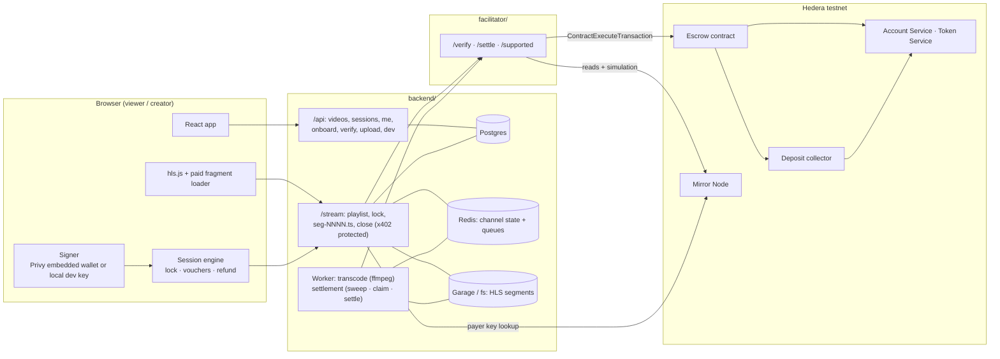
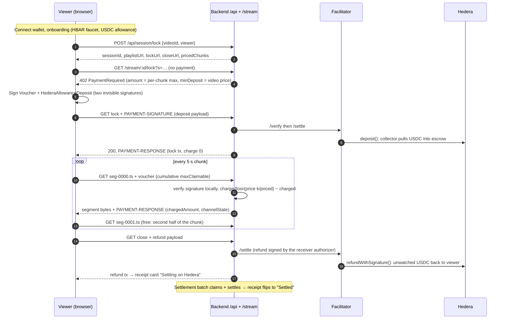

# HederaTube

**Pay-per-second video on Hedera. Lock the price of a video in USDC, pay only for the seconds you watch, get the rest back automatically.**

HederaTube is a video platform where viewers pay creators per 5-second chunk with off-chain signed vouchers, backed by a USDC escrow on Hedera. There is no subscription, no ads, and no per-request blockchain transaction: a viewing session costs the viewer one deposit at the start and one refund at the end, and the creator receives everything they earned in a single settlement transaction that can cover thousands of sessions.

It is built on the open [x402](https://github.com/x402-foundation/x402) payment standard, for which this repository contributes a native Hedera implementation of the `batch-settlement` scheme (smart contracts, SDK, spec and examples).

---

## Table of contents

- [What HederaTube is](#what-hederatube-is)
- [Repository layout](#repository-layout)
- [Architecture](#architecture)
- [User flows](#user-flows)
  - [Viewer](#viewer)
  - [Creator](#creator)
  - [Background settlement](#background-settlement)
- [Technical design](#technical-design)
  - [Pricing model](#pricing-model)
  - [Payment channels on Hedera](#payment-channels-on-hedera)
  - [Frontend](#frontend)
  - [Backend](#backend)
  - [Facilitator](#facilitator)
  - [Data model](#data-model)
  - [Security and trust model](#security-and-trust-model)
- [Contract deployments](#contract-deployments)
- [Getting started](#getting-started)
- [Configuration reference](#configuration-reference)
- [Development](#development)
- [Status and limitations](#status-and-limitations)
- [Further reading](#further-reading)

---

## What HederaTube is

**For viewers.** Sign in with Google, email or a wallet (Privy embedded wallet). The app creates a Hedera account for you, drips a little HBAR, and asks for a one-time USDC allowance. From then on, every video shows its total price (typically a few thousandths of a dollar). Press play: the full price is deposited into an escrow contract in one transaction while the button spins. As you watch, each 5-second chunk is paid with a signed voucher that never touches the chain. When you leave, the unwatched part of the deposit is refunded to you in one transaction, and a receipt card shows what you paid and what came back, with a link to the transaction.

**For creators.** Verify once with a World ID Selfie Check (scan the QR with World App), name your channel, upload a video, let the worker transcode it into HLS, set a total price (the app suggests 0.0012 USDC per minute), and publish. Earnings accumulate as vouchers and are swept to your Hedera account by a periodic settlement batch. A per-video session list shows who watched how much and whether their session is streaming, pending or settled.

**Why Hedera.** Fees are fixed and low, finality is seconds, USDC is a native Hedera Token Service (HTS) token, and the network's system contracts let a smart contract verify any Hedera account signature and pull HTS tokens via allowances. That makes payment channels practical without EVM wallet conventions like Permit2 or ERC-3009.

**Why payment channels.** Per-request on-chain payments cannot price a 5-second chunk at a fraction of a cent: the fee would exceed the price and the latency would stall playback. A channel turns a session of N chunks into two transactions (deposit and refund) plus one shared settlement transaction per creator.

## Repository layout

```
HederaTube/
├── frontend/          Vite + React 19 web app (viewer and creator UI, x402 client, HLS player)
├── backend/           Express API + /stream resource server, BullMQ worker (transcode, settlement)
├── facilitator/       Standalone x402 facilitator for the Hedera batch-settlement scheme
├── x402/              Vendored x402 monorepo + the Hedera batch-settlement scheme
│   ├── contracts/evm/src/hedera/                 x402BatchSettlementHedera.sol, HederaAllowanceDepositCollector.sol
│   ├── specs/schemes/batch-settlement/           scheme_batch_settlement_hedera.md
│   ├── typescript/packages/mechanisms/hedera/    @x402/hedera (batch-settlement client/server/facilitator)
│   └── examples/typescript/*/batch-settlement-hedera/  Reference client, server and facilitator
├── docker-compose.yml       Production stack (Garage, Postgres, Redis, facilitator, api, worker, web) with Traefik labels
├── docker-compose.dev.yml   Local infrastructure only (Postgres, Redis, Garage)
└── garage.toml              Garage (S3-compatible object store) single-node config
```

Each of `frontend/`, `backend/` and `facilitator/` is its own pnpm project that links the `@x402/*` packages straight out of `x402/typescript` (`link:` dependencies), so the vendored workspace must be built first.

## Architecture



| Component | Role | Hedera account it holds |
| --- | --- | --- |
| **Frontend** | Signs vouchers and deposit authorizations in the browser. Never submits a transaction during playback. | The viewer's wallet (ECDSA key via Privy, or a local dev key). |
| **Backend API + stream server** | x402 resource server. Prices chunks, verifies vouchers locally, records charges, serves segments. Owns the **receiver authorizer** key that signs claim batches and refunds. | Receiver authorizer, plus an operator key for the HBAR faucet. |
| **Backend worker** | Transcodes uploads to HLS. Runs the settlement job: sweeps abandoned sessions, claims vouchers per creator, settles escrow to creators. | None (uses the API's authorizer through the shared scheme). |
| **Facilitator** | Verifies payloads and submits `deposit`, `claimWithSignature`, `settle` and `refundWithSignature` to the escrow. Pays gas. | Operator account funded with HBAR. |
| **Creators** | Receive USDC from settlements. | Their own account, associated with USDC. |

The facilitator is never the source of value: deposits move USDC from the viewer under the viewer's own allowance and signature, claims only update accounting, settle transfers escrowed USDC to the creator, refunds return escrow to the viewer.

## User flows

### Viewer



Step by step, as the viewer sees it:

1. **Connect.** The header offers Google, email or wallet login through Privy. Without a Privy app id the app generates a local secp256k1 key in IndexedDB instead.
2. **Onboarding.** The wallet's EVM address has no Hedera account yet. The backend faucet sends it a few HBAR, which auto-creates the account. The app then associates the account with USDC (`associate()` on the token, IHRC-719) and sends one `approve` on USDC's ERC-20 facade through the Hedera JSON-RPC relay, granting the deposit collector an HTS allowance. These are the only transactions the viewer ever signs and pays for. All steps are skipped on later visits.
3. **Browse.** The home grid shows videos with their total price. The wallet pill shows the USDC balance read from the Mirror Node; the wallet popover behind the avatar lists the Hedera, EVM and Solana deposit addresses.
4. **Lock.** On the watch page a play circle covers the poster; clicking anywhere on it opens a session, then pays the lock route once. The client SDK sees an empty channel and builds a deposit for exactly the video price. The circle spins for about four seconds while the facilitator submits the deposit and waits for consensus (it no longer waits for the Mirror Node to catch up).
5. **Watch.** Playback starts (free preview chunks first, if any). The custom hls.js loader routes the first segment of every priced chunk through the x402 fetch wrapper with a fresh cumulative voucher. The second segment of each chunk and any already-paid chunk stream free. The overlay shows how much of the lock has been used so far. Seeking only pays for chunks not yet paid.
6. **Interruption.** If a paid request fails (network, facilitator, signer), playback pauses at the last paid second with a banner and a retry button. An in-flight paid request is never aborted after the voucher has been sent, so client and server never disagree on the cumulative amount.
7. **Leave.** Navigating away or the video ending closes the session: the engine waits for in-flight vouchers, pushes an optimistic receipt card, and sends a cooperative refund of `price − watched`. If the tab is closed instead, a keepalive request marks the session "closing" and the server-side sweeper refunds it. My channel lists active locks, reconciled against the server, with a manual **Release** as a last resort.
8. **Receipt.** The receipt card shows the locked and refunded amounts and, as the hero line, what was paid, with a Receipt link to the refund transaction on HashScan. The settlement batch runs a few seconds after every close, so the card flips to "Settled" with the batch transaction shortly after. Receipts live outside the router so they survive navigation.

### Creator

1. **Verify.** A wallet that has not passed World ID's Selfie Check sees **Verify** in the header instead of Create. Pressing it asks the backend for a relying-party context signed with the portal's RP key, then IDKit shows a QR code to scan with World App (Selfie Check, credential 11, requested as a World ID 3.0 proof). The backend forwards the result to World's verifier and stores the RP-scoped nullifier on the creator row under a unique index, so one face cannot open a second channel. Without a World app id the build simulates the check.
2. **Upload.** The `/upload` page asks for a presigned target, then streams the file either through the API upload proxy (default) or directly to Garage with a presigned URL. On completion the video enters `processing` and a transcode job is queued.
3. **Transcode.** The worker runs ffmpeg: a single 720p rendition with 2.5-second segments and keyframes forced on segment boundaries, plus a thumbnail. Segment durations are read back from the playlist, the real duration comes from ffprobe, and the video becomes `ready`.
4. **Publish.** The creator sets a total price while a Studio-style card on the right previews the file, its link and processing state. The UI suggests a price from the duration, shows the per-minute rate, and rejects anything below the minimum for that length (at least one base unit per priced chunk and never below 0.0010 USDC). Title and description travel with the publish call. Free preview chunks are supported by the server but not exposed in the upload form.
5. **Earn.** My channel has Watch, Wallet, Earnings and Profile tabs: receipts and active locks, the wallet panel with disconnect, earnings per video (chunks served, earned, pending payout, status), and the channel name and description shown on cards and the channel page. The channel page lists videos and totals. Per-video session lists show viewers, paid amounts, watched percentage and a badge (streaming, pending, settled, free).

### Background settlement

The worker runs a settlement job every `SETTLEMENT_INTERVAL_SECONDS` (default 60), a few seconds after any session closes (closes inside the window share one job), and on demand through `POST /api/dev/run-batch`:

1. **Sweep.** Sessions marked `closing`, or `locked`/`streaming` with no activity for `ABANDONED_AFTER_SECONDS` (default 90), get a cooperative refund of `balance − charged` and are closed. A session whose lock never settled on chain is closed with nothing to refund.
2. **Claim.** For each creator, channels with charges above `totalClaimed` are batched (up to `MAX_CLAIMS_PER_BATCH`), the receiver authorizer signs the `ClaimBatch`, and the facilitator calls `claimWithSignature`.
3. **Settle.** The facilitator calls `settle(receiver, token)`, which moves every claimed-but-unsettled base unit for that creator to their account in one transfer.
4. **Link.** Closed sessions of that creator are marked `settled` and linked to a settlement row holding the settle transaction, claim transactions, session and voucher counts, and totals.

## Technical design

### Pricing model

All money math is integer arithmetic on USDC base units (6 decimals).

| Concept | Definition |
| --- | --- |
| Segment | 2.5 s of HLS, the delivery unit. `seg-NNNN.ts`. |
| Chunk | 5 s, two segments, the billing unit. |
| Free preview | The first `free_preview_chunks` chunks (0 to 12) stream without payment. |
| Priced chunks | `chunkCount − free_preview_chunks`, minimum 1. |
| Total price | Set by the creator. Suggested `1200` base units (0.0012 USDC) per minute. Minimum `max(pricedChunks, 1000)`. |
| Per-request ceiling | `ceil(totalPrice / pricedChunks)`, announced as `amount` in the 402. |
| Cumulative charge after k priced chunks | `floor(totalPrice × k / pricedChunks)`. Watching to the end pays exactly the total price, never more. |
| Charge for chunk k | Cumulative(k) − cumulative(k−1), applied server-side as a settlement override. |

The same functions exist in `frontend/src/lib/price.ts` and `backend/src/shared/price.ts` and are unit-tested on both sides. The server classifies every segment request as `preview`, `paid` (first segment of an unpaid chunk), `already-paid`, `second-paid` or `second-unpaid`; only `paid` goes through x402, and `second-unpaid` is refused with a 402 so a client cannot skip the voucher.

### Payment channels on Hedera

HederaTube uses the x402 `batch-settlement` scheme in its Hedera binding. One payment channel per viewing session, with the channel salt derived from the session id, so the deposit is exactly the video price and the refund at close drains what was not watched.

**Contracts** (`x402/contracts/evm/src/hedera/`, Foundry):

- `x402BatchSettlementHedera` is the escrow. A channel is identified by the EIP-712 hash of an immutable `ChannelConfig { payer, payerAuthorizer, receiver, receiverAuthorizer, token, withdrawDelay, salt }`. It tracks `balance` and `totalClaimed` per channel and `totalClaimed` / `totalSettled` per receiver and token. Every signature (payer voucher, receiver-authorizer claim batch and refund) is verified by `isAuthorizedRaw` on the Hedera Account Service system contract ([HIP-632](https://hips.hedera.com/hip/hip-632)), so both 64-byte ED25519 and 65-byte ECDSA account signatures work with no EIP-1271 path. `associateToken` is permissionless.
- `HederaAllowanceDepositCollector` pulls deposits. It checks a payer-signed authorization (channel id, token, amount, nonce, deadline, collector, chain id), marks the nonce used, and calls the Hedera Token Service `transferFrom` ([HIP-906](https://hips.hedera.com/hip/hip-906)) against the allowance the payer granted it. Amounts are bounded by the HTS `int64` range.

**Operations**, all submitted by the facilitator's operator account as `ContractExecuteTransaction`s with fixed gas limits:

| Call | Trigger in HederaTube | Gas |
| --- | --- | --- |
| `deposit` | Lock route | 1 500 000 |
| `claimWithSignature` | Settlement job, per creator | 400 000 + 250 000 per voucher |
| `settle` | Settlement job, per creator | 600 000 |
| `refundWithSignature` | Close route, sweeper | 1 200 000 |
| `initiateWithdraw` / `finalizeWithdraw` | Viewer escape hatch, called directly by the viewer | n/a |

**Signatures**:

| Signature | Digest | Signer |
| --- | --- | --- |
| Voucher | EIP-712 `Voucher(bytes32 channelId, uint128 maxClaimableAmount)` | Viewer |
| Deposit authorization | `keccak256(abi.encode(typehash, channelId, token, amount, nonce, deadline, collector, chainId))` | Viewer |
| Claim batch | EIP-712 `ClaimBatch(ClaimEntry[] claims)` | Backend receiver authorizer |
| Refund | EIP-712 `Refund(bytes32 channelId, uint256 nonce, uint128 amount)` | Backend receiver authorizer |

The EIP-712 domain is `x402 Batch Settlement` version `1`, bound to chain id 296 (testnet) or 295 (mainnet) and the escrow address. Signers are Hedera accounts identified by the EVM address the network resolves for them (alias for ECDSA accounts created through an alias, long-zero otherwise). Only accounts with a single ED25519 or ECDSA key are supported.

**Wire format.** `PaymentRequirements.payTo` and `asset` are Hedera entity ids (`0.0.x`); `channelConfig` fields are EVM addresses; `SettleResponse.transaction` is a Hedera transaction id (`0.0.x@seconds.nanos`). The 402 for a HederaTube segment carries `extra.assetTransferMethod = "hts-allowance"`, `extra.receiverAuthorizer`, `extra.withdrawDelay` and `extra.minDeposit = video price`. Payload types are `deposit`, `voucher` and `refund` from the client; `claim` and `settle` from the server. Responses carry `PAYMENT-RESPONSE` with `extra.chargedAmount` and `extra.channelState` (`balance`, `totalClaimed`, `chargedCumulativeAmount`, `refundNonce`, …).

The full protocol, verification rules and error codes are in the [Hedera batch-settlement spec](x402/specs/schemes/batch-settlement/scheme_batch_settlement_hedera.md).

### Frontend

`frontend/` is Vite 7, React 19, TypeScript, Tailwind v4 with a small design-token system (`src/design/`), TanStack Query, Zustand, react-router 7, hls.js, GSAP for Flip transitions, Privy for auth and embedded wallets, IDKit for World ID.

Routes: `/` (home grid with header search and local search history), `/watch/:videoId`, `/channel/:handle`, `/me` (Watch, Wallet, Earnings, Profile), `/upload`. The wallet popover (balance, copyable Hedera / EVM / Solana deposit addresses, disconnect), the World ID verify button and the receipt stack live in the app shell.

Payment internals (`src/payments/`):

- **`x402-lite/`** is a browser-safe copy of the client half of `@x402/hedera/batch-settlement`. The upstream package imports the Hiero SDK at module top level, which the browser does not need for signing. Signing and encoding files are copied verbatim; the signer interface and address helpers are re-implemented with viem and Mirror Node fetches. Keep it in sync when the vendored package changes.
- **Signers.** `privySigner.ts` signs raw 32-byte digests through Privy's `secp256k1_sign` RPC with wallet UIs disabled (never `personal_sign`, whose EIP-191 prefix would break on-chain verification) and checks that the signature recovers to the wallet address. `localSigner.ts` is the same interface over a viem private-key account persisted in IndexedDB, optionally seeded from `VITE_DEV_PRIVATE_KEY`. Both read channel state through `POST /api/v1/contracts/call` on the Mirror Node.
- **`x402Client.ts`** builds one scheme and `x402Client` per session with `salt = keccak256(sessionId)`, IndexedDB channel storage, and a `depositStrategy` that only ever deposits exactly the announced `minDeposit` and refuses top-ups. Spend controls cap each payment at the per-chunk ceiling.
- **`sessionMachine.ts`** is the session engine, a Zustand store outside React: `idle → locking → preview/streaming → interrupted → closing → closed`, plus `insufficient`. It opens the session, pays the lock, decides which segments need payment, applies `PAYMENT-RESPONSE` state, handles interrupt and retry, and runs the close/refund sequence.
- **`hlsPaidLoader.ts`** is a custom hls.js fragment loader. Paid segments go through the engine's mutex-serialised x402 fetch; everything else is a plain fetch. `maxBufferLength` is 10 s, a two-chunk credit window, and hls.js retries are disabled so the engine owns error handling.
- **`onboarding.ts` and `allowance.ts`** implement the first-run flow: faucet, wait for the account on the Mirror Node, associate USDC (an approval on an unassociated account reverts), then `approve(collector, int64max)` on the USDC ERC-20 facade with an explicit gas limit, polling until the allowance is visible.
- **`locks.ts`** reconciles locally stored channels against session receipts and releases a lock outside the player.
- **`refundOnLeave.ts`** marks the session closing on `pagehide` with a keepalive request.

**Mock mode.** With `VITE_API_MODE=mock` (real mode is the default), MSW serves the whole API and stream in the browser: `src/mocks/` holds a localStorage-backed database, fixtures, `/api` and `/stream` handlers, a fake Mirror Node `contracts/call`, and `mocks/x402/channels.ts`, the server-side channel accounting the real backend reproduces. Demo HLS assets with a burnt-in clock are generated by `pnpm demo:assets`. The full pay flow can be exercised with no backend and no chain.

Tests (`vitest`): price math, IndexedDB channel storage, payment mutex, the paid loader, and a node end-to-end x402 flow against the mock.

### Backend

`backend/` is Express 4 with `@x402/express`, Drizzle ORM on Postgres, Redis (channel state through `RedisChannelStorage` and BullMQ queues), an S3-compatible object store (Garage in production, a local directory in development), pino logging, zod-validated env.

**API routes** (`src/api/routes/`):

| Route | Purpose |
| --- | --- |
| `GET /api/videos`, `GET /api/videos/:id`, `GET /api/videos/:id/thumbnail` | Catalogue |
| `GET /api/video/:id/sessions`, `POST /api/video/:id/like` | Per-video session list (recent / top) and likes |
| `POST /api/session/lock` | Creates the session row and returns playlist, lock and close URLs. The deposit itself happens on the x402 lock route. |
| `POST /api/session/close`, `GET /api/session/:id/receipt` | Best-effort close for pagehide or refund failure; two-phase receipt |
| `GET /api/me`, `GET /api/me/earnings`, `GET /api/channel/:handle`, `GET /api/wallet/balance` | Viewer and creator views |
| `POST /api/onboard/faucet` | HBAR drip to an EVM address, once per address. Creates the hollow account. USDC is never dripped. |
| `POST /api/verify/world/request`, `POST /api/verify/world` | World ID request context and proof submission; creates the creator |
| `POST /api/upload/presign`, `PUT /api/upload/put/:videoId/:name`, `POST /api/upload/complete`, `POST /api/upload/publish` | Upload, queue transcode, publish with price |
| `POST /api/dev/run-batch` | Runs the settlement job now (when `DEV_ENDPOINTS=true`) |
| `GET /api/health` | Liveness |

**Stream pipeline** (`src/api/stream/`). Every `/stream/:videoId/(playlist.m3u8|lock|close|seg-NNNN.ts)?s=sessionId` request first passes `loadSession`, which loads session, video and creator and runs the rest of the chain inside an `AsyncLocalStorage` context. The x402 payment middleware then sees three protected route patterns (`lock`, `seg-*`, `close`) whose `payTo` and price are resolved per request from that context: `payTo` is the creator's account, `amount` is the per-chunk ceiling, `extra.minDeposit` is the video price.

Hooks on the resource server enforce HederaTube's rules before the scheme's own verification: the lock route only accepts a `deposit` payload of exactly the video price on a not-yet-locked session; segment routes only accept a `voucher` for the session's own channel after a lock; the close route only accepts a `refund` for that channel. `onProtectedRequest` grants access without payment to preview segments, second segments and already-paid chunks. `onAfterSettle` is the one place session money fields change on the request path: it records the lock transaction and channel id, inserts a `charges` row and advances `chunks_consumed` / `consumed_amount` for paid chunks, and records the refund. The handlers themselves set the settlement override (`0` for lock, the chunk delta for a paid segment) and pipe segment bytes from storage with Range support.

The scheme is configured with `enforceMinDeposit: true`, `localVoucherVerification` on (payer keys resolved from the Mirror Node, with a resolver that does not cache negative lookups because a viewer's account is hollow until its first outgoing transaction), Redis channel storage shared by the API and worker, and the backend-held receiver-authorizer signer.

**Worker** (`src/worker/`): two BullMQ workers. `transcode` downloads the source, runs ffmpeg and ffprobe, uploads segments and thumbnail, and updates the video. `settlement` is the job described under [Background settlement](#background-settlement); a repeatable job schedules it and the dev endpoint enqueues it manually. One `BatchSettlementChannelManager` exists per creator so claims and settles only touch that creator's channels.

Scripts: `db:migrate`, `seed` (demo creator, four demo videos from the frontend's generated assets, historical sessions), `e2e:testnet` (a real ECDSA test client locks, pays three chunks, streams free segments, closes with a refund, runs the batch and checks the receipt, printing HashScan links), `garage-bootstrap.sh`.

Tests (`vitest`): price math, segment classification, playlist generation.

### Facilitator

`facilitator/src/index.ts` is a small Express service wrapping `x402Facilitator` from `@x402/core` with the Hedera batch-settlement scheme.

| Method | Path | Behaviour |
| --- | --- | --- |
| `GET` | `/health` | `{ ok, network }` |
| `GET` | `/supported` | Supported kinds and fee-payer account ids. The backend calls this at startup. |
| `POST` | `/verify` | `{ paymentPayload, paymentRequirements }` → `VerifyResponse` with the channel snapshot. Handles `deposit`, `voucher`, `refund`. |
| `POST` | `/settle` | Same body → `SettleResponse` with the Hedera transaction id and `extra.channelState`. Handles `deposit`, `claim`, `settle`, `refund`. |

Every contract call is simulated through the Mirror Node before submission (`SIMULATE_BEFORE_SEND`). Reads that follow a claim or settle poll the Mirror Node for up to 10 s because it lags consensus by a few seconds; the deposit path skips that wait (`mirrorLagPollMs: 0`) because HederaTube verifies vouchers against its own channel store. If a transaction was submitted but its record cannot be fetched, `settlement_pending` is returned with the transaction id.

In HederaTube the facilitator runs **without** a receiver authorizer: the backend holds that key, so only the backend can authorize claims and refunds. The facilitator can optionally advertise its own authorizer for other servers, but it does not authenticate refund requests, so that mode is only for trusted servers.

### Data model

Postgres tables (`backend/src/shared/db/schema.ts`, migrations in `backend/drizzle/`):

| Table | Holds |
| --- | --- |
| `creators` | Wallet address, Hedera account id, handle, display name, World ID nullifier hash, verification time |
| `videos` | Title, description, duration, segment and chunk counts, per-segment durations, status (`processing` / `ready` / `failed`), free preview chunks, total price, storage keys |
| `sessions` | One per viewing session: viewer, locked amount, priced chunk count, channel id, lock tx, chunks served and consumed, consumed and refunded amounts, refund tx, status (`locked` / `streaming` / `closing` / `closed` / `settled` / `failed`), close reason, settlement id |
| `charges` | One row per paid chunk: chunk index, priced index, amount, cumulative |
| `settlements` | One per creator per batch: settle tx, claim txs, session and voucher counts, totals |
| `likes`, `faucet_drips` | Likes per viewer; one faucet drip per address |

Redis holds the x402 channel state (balance, totalClaimed, chargedCumulativeAmount, latest voucher, pending request) under `hederatube:channel:*`, and the BullMQ queues. Object storage keys are `uploads/<videoId>/<name>` for sources, `videos/<videoId>/seg-NNNN.ts` for segments and `videos/<videoId>/thumb.jpg` for thumbnails.

### Security and trust model

- **Capital-backed.** The viewer's own escrowed USDC backs every voucher. Creators need no trust in an intermediary to be paid for served chunks.
- **Never overpay.** The client refuses top-ups and any `minDeposit` other than the video price; the server refuses deposits that are not the video price; cumulative charges are capped by construction at the total price.
- **Never underpay.** The second segment of a chunk is refused until the first was paid; vouchers are cumulative so an old voucher can never claim more than a newer one; a paid request is never aborted mid-flight.
- **Allowance scope.** The USDC allowance is granted to the collector only, which moves funds solely into the escrow and solely for a channel id the viewer signed.
- **Replay protection.** Deposit authorizations carry a nonce consumed on chain, a deadline, the collector address and the chain id. Refunds carry a per-channel nonce.
- **Key custody.** The receiver-authorizer key lives in the backend, not the facilitator. The facilitator only pays gas; gas is bounded per call.
- **Escape hatch.** If HederaTube disappears, a viewer can call `initiateWithdraw` on the escrow themselves, wait `withdrawDelay` (900 s by default here, 15 minutes to 30 days by protocol), and `finalizeWithdraw`. During the delay the server can still claim outstanding vouchers.
- **Signature verification is on chain by the network.** Because the Account Service checks against the account's current key, rotating the key invalidates old signatures immediately.

## Contract deployments

| Network | `x402BatchSettlementHedera` (escrow) | `HederaAllowanceDepositCollector` |
| --- | --- | --- |
| `hedera:testnet` (chain id 296) | [`0.0.10463847`](https://hashscan.io/testnet/contract/0.0.10463847) · [Sourcify verified](https://sourcify.dev/server/v2/contract/296/0x00000000000000000000000000000000009FaA67) | [`0.0.10463851`](https://hashscan.io/testnet/contract/0.0.10463851) · [Sourcify verified](https://sourcify.dev/server/v2/contract/296/0x00000000000000000000000000000000009FAA6B) |
| `hedera:mainnet` (chain id 295) | not deployed | not deployed |

The SDK picks these up from `BATCH_SETTLEMENT_DEPLOYMENTS`; `registerBatchSettlementDeployment` points it at your own. Testnet USDC is `0.0.429274`. The frontend's mock and the backend seed use creator account `0.0.10463864`.

## Getting started

There are three ways to run HederaTube, from lightest to heaviest.

### Prerequisites

- Node.js 22 and [pnpm](https://pnpm.io) (the Dockerfiles pin pnpm 11.1.1)
- ffmpeg and ffprobe on `PATH` (demo assets, transcoding)
- For the real stack: Postgres, Redis, and testnet accounts from the [Hedera Portal](https://portal.hedera.com) for the **facilitator operator** (HBAR), the **backend operator** for the faucet (HBAR, can be the same account), and the **receiver authorizer**. Viewers need testnet USDC from the [Circle faucet](https://faucet.circle.com).
- [Foundry](https://getfoundry.sh) only for contract tests or your own deployment.

### Build the vendored x402 packages once

```bash
cd x402/typescript && pnpm install && pnpm --filter "@x402/hedera..." build && pnpm --filter @x402/express build && pnpm --filter @x402/fetch build
```

### Option A: frontend only, everything mocked

No backend, no chain, no keys. MSW serves the API and stream in the browser.

```bash
cd frontend && pnpm install && pnpm demo:assets && cp .env.example .env && pnpm dev
```

Set `VITE_API_MODE=mock` and `VITE_ONBOARD_MODE=mock` in `frontend/.env`. Open `http://localhost:5173`, connect the wallet (a local key is generated when `VITE_PRIVY_APP_ID` is empty), open a video, press play, leave to see the receipt. The mock settles closed sessions on its own schedule; `POST /api/dev/run-batch` is the manual trigger against a real backend.

### Option B: full local stack against Hedera testnet

1. **Infrastructure.** Either local services or the dev compose file:

```bash
docker compose -f docker-compose.dev.yml up -d postgres redis
```

2. **Facilitator.** Copy `facilitator/.env-local` to `facilitator/.env`, set the operator account and key, and leave the receiver-authorizer variables empty.

```bash
cd facilitator && pnpm install && pnpm dev
```

3. **Backend.** Copy `backend/.env-local` to `backend/.env`, set `DATABASE_URL`, `REDIS_URL`, the faucet operator and the receiver authorizer. `STORAGE_DRIVER=fs` keeps objects under `backend/storage`.

```bash
cd backend && pnpm install && pnpm db:migrate && pnpm seed
```

```bash
cd backend && pnpm dev:api
```

```bash
cd backend && pnpm dev:worker
```

4. **Frontend in real mode** (the default in `.env.example`): `VITE_API_MODE=real`, `VITE_ONBOARD_MODE=real`, `VITE_MIRROR_CONTRACT_CALL_URL=https://testnet.mirrornode.hedera.com`, plus `VITE_PRIVY_APP_ID` and `VITE_WORLD_APP_ID`. Vite proxies `/api` and `/stream` to the backend.

```bash
cd frontend && pnpm dev
```

A new viewer then goes through the real faucet drip and USDC allowance approval, and every lock, refund and settlement appears on [HashScan](https://hashscan.io/testnet).

5. **Scripted end-to-end check.** With the API, worker and facilitator running:

```bash
cd backend && pnpm e2e:testnet
```

### Option C: production compose (Dokploy / Traefik)

`docker-compose.yml` builds and runs Garage, Postgres, Redis, the facilitator, the API, the worker and the nginx-served web build. Traefik labels route `/api` and `/stream` to the API and everything else to the web container. Secrets and env come from `facilitator/.env`, `backend/.env`, the `secrets/garage_rpc_secret` and `secrets/garage_admin_token` files, and `POSTGRES_PASSWORD`, `S3_BUCKET`, `VITE_PRIVY_APP_ID`, `VITE_WORLD_APP_ID` and `VITE_WORLD_ENVIRONMENT` in the environment. A one-shot `garage-init` container creates the bucket and access key.

```bash
docker compose up -d --build
```

## Configuration reference

### Frontend (`frontend/.env`)

| Variable | Description |
| --- | --- |
| `VITE_API_MODE` | `real` (default: proxy `/api` and `/stream` to `VITE_API_TARGET`) or `mock` (MSW in the browser). |
| `VITE_API_TARGET` | Backend origin for real mode. |
| `VITE_PRIVY_APP_ID` | Enables the Privy embedded wallet. Empty means a local dev key. |
| `VITE_WALLET_MODE` | `privy` or `local`; defaults from the app id. |
| `VITE_DEV_PRIVATE_KEY` | Local mode only: use this funded testnet key instead of generating one. |
| `VITE_ONBOARD_MODE` | `mock` renders faucet and allowance as done; `real` runs them. |
| `VITE_WORLD_APP_ID`, `VITE_WORLD_ACTION` | World app id and action from the Developer Portal. With the app id set, Verify opens IDKit; without it the check is simulated. |
| `VITE_WORLD_ENVIRONMENT` | `production`, `staging` or `sandbox`: decides which World App the QR code opens. |
| `VITE_HEDERA_NETWORK`, `VITE_MIRROR_NODE_URL`, `VITE_MIRROR_CONTRACT_CALL_URL`, `VITE_HASHIO_RPC` | Network endpoints. In mock mode contract calls go to `/mock-mirror`. |
| `VITE_MOCK_CREATOR_ACCOUNT_ID`, `VITE_MOCK_RECEIVER_AUTHORIZER` | Values the mock 402s advertise. |
| `VITE_WORLD_VERIFY_MODE`, `VITE_SQUID_INTEGRATOR_ID` | Legacy flags; the Squid deposit widget is not wired into the UI. |

### Backend (`backend/.env`)

| Variable | Description |
| --- | --- |
| `PORT`, `LOG_LEVEL`, `PUBLIC_BASE_URL` | Server basics (default port 4021). |
| `DATABASE_URL`, `REDIS_URL` | Postgres and Redis. |
| `STORAGE_DRIVER` | `fs` (local directory `STORAGE_FS_DIR`) or `s3` (Garage: `S3_ENDPOINT`, `S3_PUBLIC_ENDPOINT`, `S3_REGION`, `S3_BUCKET`, `S3_ACCESS_KEY`, `S3_SECRET_KEY`). |
| `UPLOAD_MODE` | `proxy` (browser PUTs through the API) or `presign` (direct to storage; bucket CORS is set at startup). |
| `FACILITATOR_URL`, `HEDERA_NETWORK`, `HEDERA_MIRROR_NODE_URL`, `HEDERA_JSON_RPC_URL`, `HEDERA_USDC_TOKEN_ID` | x402 and network endpoints. |
| `HEDERA_OPERATOR_ACCOUNT_ID`, `HEDERA_OPERATOR_PRIVATE_KEY` | Faucet payer (HBAR). |
| `HEDERA_RECEIVER_AUTHORIZER_ACCOUNT_ID`, `HEDERA_RECEIVER_AUTHORIZER_PRIVATE_KEY` | Signs claim batches and refunds. Required. Must not also be configured on the facilitator. |
| `WITHDRAW_DELAY_SECONDS` | Committed into every channel (default 900). |
| `MAX_TIMEOUT_SECONDS` | `maxTimeoutSeconds` in 402s (default 600). |
| `FAUCET_HBAR` | HBAR per drip (default 5). |
| `ABANDONED_AFTER_SECONDS` | Idle time before the sweeper refunds a session (default 90). |
| `SETTLEMENT_INTERVAL_SECONDS`, `MAX_CLAIMS_PER_BATCH` | Settlement job cadence and batch size (defaults 60 and 25). |
| `DEV_ENDPOINTS` | Expose `POST /api/dev/run-batch` (default true). |
| `WORLD_VERIFY_MODE` | `real` verifies proofs with World; `simulate` derives a nullifier from the wallet and skips the proof. |
| `WORLD_APP_ID`, `WORLD_RP_ID`, `WORLD_RP_SIGNING_KEY`, `WORLD_ACTION`, `WORLD_ENVIRONMENT` | World Developer Portal app id, relying-party id and 32-byte signing key (signs every IDKit request), the action name, and the environment the proofs come from. |
| `SEED_CREATOR_ACCOUNT_ID`, `SEED_CREATOR_WALLET` | Demo creator used by the seed and as the scheme's default receiver. |

### Facilitator (`facilitator/.env`)

| Variable | Description |
| --- | --- |
| `HEDERA_ACCOUNT_ID`, `HEDERA_PRIVATE_KEY` | Operator: pays gas, is `msg.sender` of every contract call. Needs HBAR. |
| `HEDERA_RECEIVER_AUTHORIZER_ACCOUNT_ID`, `HEDERA_RECEIVER_AUTHORIZER_PRIVATE_KEY` | Leave empty for HederaTube. When set, the facilitator advertises itself as authorizer for servers that delegate. |
| `HEDERA_NETWORK`, `HEDERA_MIRROR_NODE_URL` | Network and optional Mirror Node override. |
| `SIMULATE_BEFORE_SEND` | Simulate contract calls via the Mirror Node before submitting (default true). |
| `PORT` | Default 4022. |

Keys may be DER hex, raw hex, or `0x`-prefixed ECDSA hex.

## Development

### Tests

```bash
cd frontend && pnpm test
```

```bash
cd backend && pnpm test
```

```bash
cd x402/typescript/packages/mechanisms/hedera && pnpm test
```

```bash
cd x402/contracts/evm && forge test --match-path 'test/hedera/*'
```

The SDK also has an env-gated live testnet integration test (`pnpm test:integration` in the Hedera package) and the backend has `pnpm e2e:testnet`. Type checks: `pnpm typecheck` in `frontend/`, `backend/` and `facilitator/`.

### Deploying your own contracts

```bash
cd x402/contracts/evm && forge build
```

```bash
cd x402/typescript/packages/mechanisms/hedera && HEDERA_OPERATOR_ID=0.0.x HEDERA_OPERATOR_KEY=... HEDERA_NETWORK=hedera:testnet pnpm deploy:batch-settlement
```

The script deploys both contracts with unlimited automatic token associations, associates the escrow with USDC and prints the deployment entry to register. Helper scripts in the same package create funded test accounts (`scripts/create-test-accounts.ts`) and probe the Account Service with real signatures (`scripts/probe-has.ts`).

### Working with the vendored monorepo

`x402/` is a subtree of [x402-foundation/x402](https://github.com/x402-foundation/x402) at upstream commit `3c2ddfb9`. The Hedera additions are isolated under `contracts/evm/src/hedera`, `typescript/packages/mechanisms/hedera/src/batch-settlement`, the three `*-hedera` examples and the Hedera spec. After editing the SDK, rebuild it (`pnpm --filter "@x402/hedera..." build`) so the linked apps pick it up, and mirror client-side changes into `frontend/src/payments/x402-lite/`.

## Status and limitations

- **Testnet only.** Contracts are deployed and verified on `hedera:testnet`; mainnet is not deployed.
- **World ID Selfie Check is a gated beta.** The flow is real (signed RP context, QR, proof verified by World), but the credential has to be enabled for the app by World; the sandbox app is used for testing. Without an app id the check is simulated.
- **Deposits are by address, and there is no withdraw.** The wallet popover shows the Hedera, EVM and Solana addresses to fund; the Squid widget is not wired in and viewers withdraw through the escrow's own escape hatch. Live streams are not supported.
- **Faucet drips HBAR only.** Viewers must obtain testnet USDC themselves.
- **Single rendition.** Transcoding produces one 720p HLS rendition.
- **Key types.** Viewer wallets are ECDSA (Privy or local). The scheme also supports ED25519 accounts, but only single-key accounts; threshold and key-list accounts are rejected.
- **Mirror Node lag.** Channel reads and simulations lag consensus by a few seconds; claims and settles poll for it, the deposit path no longer waits, and the client recovers via corrective 402s.
- **Facilitator refund authentication.** Do not enable the facilitator's own receiver authorizer unless every server using it is trusted.

## Further reading

- [Frontend README](frontend/README.md), [Backend README](backend/README.md), [Facilitator README](facilitator/README.md)
- [Hedera batch-settlement scheme specification](x402/specs/schemes/batch-settlement/scheme_batch_settlement_hedera.md), the [generic scheme](x402/specs/schemes/batch-settlement/scheme_batch_settlement.md) and the [EVM binding](x402/specs/schemes/batch-settlement/scheme_batch_settlement_evm.md) it mirrors
- [`@x402/hedera/batch-settlement` README](x402/typescript/packages/mechanisms/hedera/src/batch-settlement/README.md) and [`@x402/hedera` README](x402/typescript/packages/mechanisms/hedera/README.md)
- [Contracts README](x402/contracts/evm/README.md)
- [HIP-632 Hedera Account Service](https://hips.hedera.com/hip/hip-632), [HIP-906 HTS allowance calls from contracts](https://hips.hedera.com/hip/hip-906)
- [x402 protocol](https://github.com/x402-foundation/x402)
